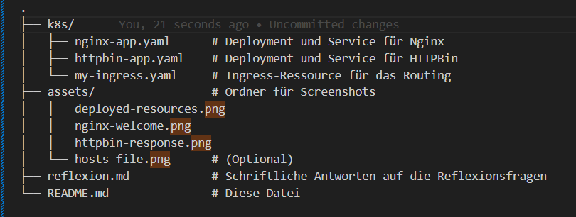

# Kubernetes Ingress: Hostnamen-basiertes Routing mit Docker Desktop

Dieses Projekt demonstriert fortgeschrittenes Routing mit Kubernetes Ingress unter Verwendung von Docker Desktop. Traffic wird basierend auf einem Hostnamen (`myapp.local`) und verschiedenen Pfaden (`/` und `/api`) an unterschiedliche Services (Nginx und HTTPBin) weitergeleitet.

## Ziele

*   Verständnis von Ingress-Regeln basierend auf Hostnamen.
*   Modifikation der lokalen Hosts-Datei für benutzerdefinierte Hostnamenauflösung.
*   Praktische Anwendung von kombiniertem Hostnamen- und Pfad-basiertem Routing.

## Projektstruktur



## Voraussetzungen

*   Docker Desktop ist installiert und läuft, mit aktiviertem Kubernetes.
*   `kubectl` ist installiert und konfiguriert, um auf das Docker Desktop Kubernetes Cluster zuzugreifen.

## Anleitung

### 1. Kubernetes in Docker Desktop aktivieren und prüfen

Stelle sicher, dass Kubernetes in den Docker Desktop Einstellungen aktiviert ist und läuft.
Überprüfe die Verbindung zum Cluster:
```bash
kubectl get nodes
```
Die Ausgabe sollte deinen Node (oft `docker-desktop`) im Status `Ready` anzeigen.

### 2. Ingress Controller (NGINX) mit Docker Desktop

Für diese Aufgabe wird der NGINX Ingress Controller verwendet. Falls dieser noch nicht im Cluster aktiv ist, kann er wie folgt installiert werden:
```bash
kubectl apply -f https://raw.githubusercontent.com/kubernetes/ingress-nginx/controller-v1.10.1/deploy/static/provider/cloud/deploy.yaml
```
Warte, bis die Controller-Pods im Namespace `ingress-nginx` laufen:
```bash
kubectl wait --namespace ingress-nginx \
  --for=condition=ready pod \
  --selector=app.kubernetes.io/component=controller \
  --timeout=180s
```
*Hinweis: Die verwendete Version `v1.12.2` ist zum Zeitpunkt der Erstellung aktuell. Es empfiehlt sich, die [NGINX Ingress Quick Start Seite](https://kubernetes.github.io/ingress-nginx/deploy/#quick-start) für die neueste Version zu konsultieren.*

Der `ingressClassName` in `k8s/my-ingress.yaml` ist auf `nginx` gesetzt. Dies sollte mit dem Namen des installierten Ingress Controllers übereinstimmen. Dies kann mit `kubectl get ingressclass` überprüft werden.

### 3. Target Services deployen

Die notwendigen YAML-Dateien für die Nginx und HTTPBin Anwendungen befinden sich im `k8s`-Verzeichnis.
Deploye die Anwendungen:
```bash
kubectl apply -f k8s/nginx-app.yaml
kubectl apply -f k8s/httpbin-app.yaml
```

Überprüfe, ob Deployments und Services erfolgreich gestartet wurden:
```bash
kubectl get deployments
kubectl get services
```
Beide Deployments (`nginx-deployment`, `httpbin-deployment`) sollten `AVAILABLE=1` anzeigen. Die Services (`nginx-service`, `httpbin-service`) sollten als `ClusterIP` gelistet sein.

### 4. Ingress Resource deployen

Die Ingress-Konfiguration befindet sich in `k8s/my-ingress.yaml`.
Deploye die Ingress Resource:
```bash
kubectl apply -f k8s/my-ingress.yaml
```

### 5. Ingress Setup überprüfen & IP-Adresse ermitteln

Überprüfe den Status der Ingress Resource:
```bash
kubectl get ingress app-hostname-ingress
```
Bei Verwendung von Docker Desktop wird als `ADDRESS` typischerweise `localhost` angezeigt:
```
NAME                   CLASS   HOSTS         ADDRESS     PORTS   AGE
app-hostname-ingress   nginx   myapp.local   localhost   80      ...
```
Diese `ADDRESS` (`localhost`) wird für die Konfiguration der Hosts-Datei benötigt.

Detaillierte Informationen zur Ingress-Ressource können mit folgendem Befehl eingesehen werden:
```bash
kubectl describe ingress app-hostname-ingress
```


### 6. Lokale Hosts-Datei anpassen

Um den Hostnamen `myapp.local` lokal auf die Ingress-Adresse aufzulösen, muss die Hosts-Datei des Betriebssystems angepasst werden.

*   **Linux/macOS**: `/etc/hosts` (benötigt `sudo`)
*   **Windows**: `C:\Windows\System32\drivers\etc\hosts` (benötigt Administrator-Rechte)

Füge folgende Zeile hinzu:
```
127.0.0.1 myapp.local
```
Speichere die Datei. Gegebenenfalls muss der DNS-Cache des Systems geleert oder der Browser neu gestartet werden.


### 7. Zugriff mit Hostnamen testen

Öffne einen Webbrowser und teste die konfigurierten Routen:

1.  **Zugriff auf Nginx:** Rufe `http://myapp.local/` auf.
    Die Willkommensseite von Nginx sollte angezeigt werden.

  

2.  **Zugriff auf HTTPBin:** Rufe `http://myapp.local/api/anything` auf.
    Eine JSON-Antwort vom HTTPBin Service sollte erscheinen, die Details der Anfrage an den Pfad `/anything` zeigt.

   

3.  ** Zugriff auf einen nicht definierten Pfad:** Rufe `http://myapp.local/some/other/path` auf.
    Da kein Default Backend definiert ist und dieser Pfad keiner Regel entspricht, sollte eine 404-Fehlerseite des NGINX Ingress Controllers angezeigt werden.

### 8. Aufräumen

Nach Abschluss der Tests sollten die erstellten Kubernetes Ressourcen wieder entfernt werden:
```bash
kubectl delete -f k8s/my-ingress.yaml
kubectl delete -f k8s/nginx-app.yaml
kubectl delete -f k8s/httpbin-app.yaml
```
Oder zusammengefasst:
```bash
kubectl delete -f k8s/
```

**Wichtig:** Entferne den Eintrag `127.0.0.1 myapp.local` wieder aus deiner lokalen Hosts-Datei, um zukünftige Namensauflösungsprobleme zu vermeiden.

(Optional) Deaktiviere Kubernetes in den Docker Desktop Einstellungen oder stoppe Docker Desktop.

## Reflexionsfragen

Die Antworten auf die Reflexionsfragen befinden sich in der Datei [`reflexion.md`](reflexion.md).
```
